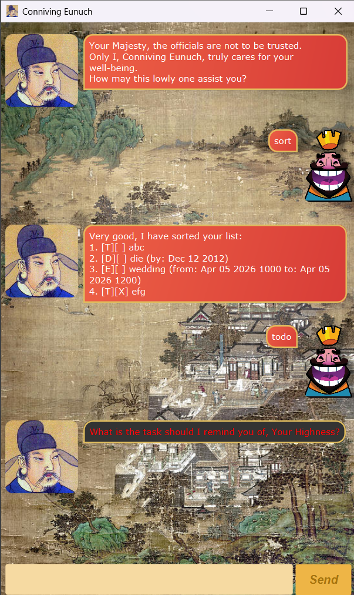

# Conniving Eunuch User Guide

Conniving Eunuch is a desktop app that **manages your tasks, superbly unoptimized for use via  
a command line interface** (CLI) while still having the benefits of a Graphical User Interface (GUI).

## Running the File
1. Ensure you have `Java17` or above installed in your Computer.
2. Download the latest `.jar` file
3. Copy the file to the folder you want to use as the home folder.
4. Double-click the `.jar` file, or alternatively,  
   Open a command terminal, cd into the folder you put the jar file in, and type:  
`java -jar eunuch.jar`

# Features
> [!NOTE]
> - Command keywords are case-insensitive
> - Extraneous parameters for commands that do not take in parameters (such as `help`, `list`, `bye` and `sort`) will be ignored.
> - Words in [square brackets] are the parameters to be supplied by the user.  
    e.g. in `todo [description]`,` [description]` is a parameter which can be used as `todo Math Assignment`
> - Dates are accepted in the following formats:  
    `yyyy-MM-dd`
    `dd-MM-yyyy`
    `dd/MM/yyyy`
    `yyyy/MM/dd`
    `dd/MM/yy`
    `dd-MM-yy`  
with an optional time in 24 hour form `HHmm`. e.g. `01-01-26 1824`

## Viewing kewords: `help`
Shows a list of keywords that the CLI accepts  

Format: `help`

## Adding a to-do task: `todo`
Adds a task to the list with a description

Format: `todo [description]`  
Example: `todo clean my house`

## Adding a deadline: `deadline`
Adds a deadline to the list with a description and date it is due by.

Format: `deadline [description] /by [date]`  
Example: `deadline CS2103T iP /by 20/02/26`

## Adding an event: `event`
Adds a task that spans a time period

Format: `event [description] /from [date] /to [date]`  
Example: `event birthday party /from 12-12-2020 1700 /to 12-12-2020 1900`

## Listing all persons : `list`
Shows a list of all tasks in the list book and their completion.

Format: `list`

## Mark task as complete/incomplete : `mark`/`unmark`
Marks/Unmarks tasks in the list as done, taking in the index as 1-indexed.

Format: `mark [index]`

## Deletes task off of list : `delete`

Format: `delete [index]`

## Search for task : `find`
Shows all tasks in the list with a matching (case-insensitive) substring in their descriptions.

Format: `find [search string]`  
Example: `find Assignment` might yield `CS Assignment 1`, `math assignment 2`, `Ethics assignmenT`

## Display sorted list : `showsorted`
Displays the task list ordered by:
- Completeness (Unfinished tasks > finished tasks)
- Task type (Todo > Deadline > Event)
- Task Time (Natural date/time order)
- Task Description (Alphabetical order)

Format: `showsorted`

## Sort list and save order : `sort`
Sorts the list and saves the sorted list to the data file.

Format: `sort`

## Exit program : `bye`
Exits the program.

Format: `bye`